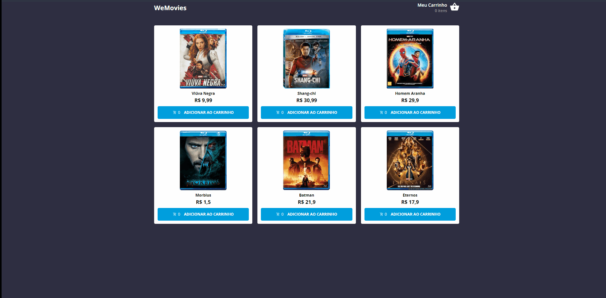

<div align="center" id="top"> 
  

&#xa0;

</div>

<h1 align="center">WeFit Challenge</h1>

<p align="center">
  


  <!--  -->

  <!--  -->

  <!--  -->
</p>

<!-- Status -->

<h4 align="center">
	 WeFit Challenge 🚀 Completed ✅
</h4>

<hr>

<p align="center">
  <a href="#dart-about">About</a> &#xa0; | &#xa0; 
  <a href="#sparkles-features">Features</a> &#xa0; | &#xa0;
  <a href="#rocket-technologies">Technologies</a> &#xa0; | &#xa0;
  <a href="#white_check_mark-requirements">Requirements</a> &#xa0; | &#xa0;
  <a href="#checkered_flag-starting">Starting</a> &#xa0; | &#xa0;
  <a href="#memo-license">License</a> &#xa0; | &#xa0;
  <a href="https://github.com/harlleybastos" target="_blank">Author</a>
</p>

<br>

## :dart: About

A E-commerce website created for succed on challenge of WeFit company.

All data rendered on the website is mocked by using Next.js so as soon as you do "yarn dev" you will see instand data for that reason.

## :sparkles: Features

:heavy_check_mark: Add and Remove Items of Shopping Cart;\
:heavy_check_mark: Responsivity;\
:heavy_check_mark: LocalStorage for prevent loss data;\
:heavy_check_mark: Globally Improved ;

## :rocket: Technologies

The following tools were used in this project:

- [Next.js](https://nextjs.org/)
- [React](https://pt-br.reactjs.org/)
- [React-Table](https://react-table-v7.tanstack.com/)
- [Context-API](https://reactjs.org/docs/context.html)
- [Styled-Components](https://styled-components.com/)
- [TypeScript](https://www.typescriptlang.org/)

## :white_check_mark: Requirements

Before starting :checkered_flag:, you need to have [Git](https://git-scm.com) and [Node](https://nodejs.org/en/) installed.

## :checkered_flag: Starting

```bash
# Clone this project
$ git clone https://github.com/harlleybastos/wefit-challenges

# Access
$ cd wefit-challenges/wefit-test-02

# Install dependencies
$ yarn install

# Run the project
$ yarn dev

# IMPORANT: It will run the backend server too so as I said on about section all the data rendered here is mocked on the Backend of Next.js.

# The server will initialize in the <http://localhost:3000>
```

## :memo: License

This project is under license from MIT. For more details, see the [LICENSE](LICENSE.md) file.

Made with :heart: by <a href="https://github.com/harlleybastos" target="_blank">Harlley Bastos</a>

&#xa0;

<a href="#top">Back to top</a>
